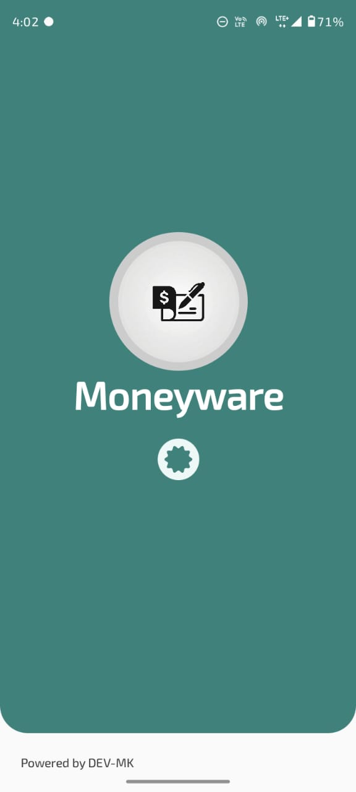
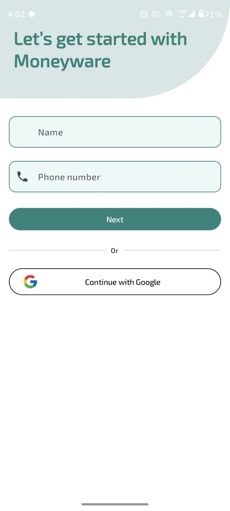
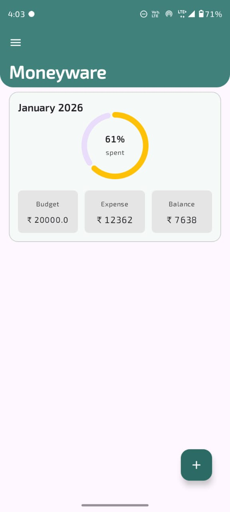
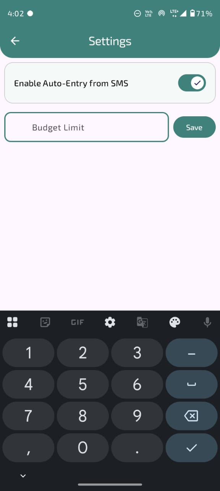
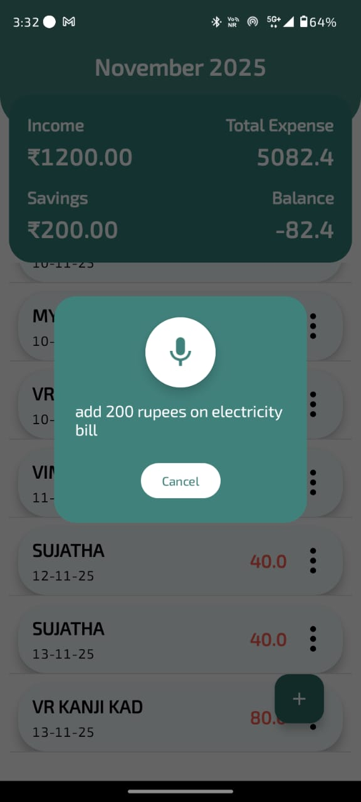

# Moneyware - Smart Expense Tracking App

Moneyware is a **production-ready Android/KMP smart expense tracking application**

The app supports **manual and automatic expense tracking**, monthly budget management, and secure cloud synchronization using Firebase.

---

##  Key Features

### Secure Expense Management
- Create, update, and delete expenses with **strict user-level access control**
- Backend-enforced ownership using Firebase Authentication and Firestore Rules
- No sensitive logic trusted to the client

### Automatic Expense Import (SMS-based)
- Reads bank debit SMS messages using Android’s ContentResolver
- Parses amount, merchant, and timestamp using regex-based parsing
- Implements **server-side deduplication** to prevent duplicate expense entries
- Deduplication is enforced atomically using **Firestore transactions**

### Notification
- Users can configure a budget threshold that determines when notifications should be triggered
- Notifications are sent when total expenses exceed the configured threshold

### Budget Tracking
- Monthly budgets with real-time expense aggregation
- Automatic creation and update of current-month budgets
- Accurate balance and utilization tracking

### Voice-Based Expense Entry (Experimental)
- Voice commands powered by **Google Gemini API**
- Orchestrated using **Koog**
- Allows users to add expenses using natural language
- Feature currently implemented in a separate module and planned for migration

---

##  Architecture & Design

Moneyware follows **Clean Architecture and MVVM principles** with a clear separation of concerns:

- **Presentation Layer**
  - Jetpack Compose Multiplatform (Android/IOS)
  - ViewModels with StateFlow

- **Domain Layer**
  - Business rules and use cases
  - Platform-agnostic Kotlin code (KMP)

- **Data Layer**
  - Firebase Firestore (Remote Data Source)
  - Android DataStore (Settings)
  - Repository pattern

##  Tech Stack

**Frontend**
- Kotlin
- Kotlin Multiplatform (KMP)
- Jetpack Compose Multiplatform

**Backend / Cloud**
- Firebase Authentication
- Cloud Firestore
- Firestore Security Rules
- Firestore Transactions

**AI / Voice**
- Google Gemini API
- Koog (Agent Orchestration)

**Other**
- Android DataStore
- Coroutines & Flow
- Gradle (Kotlin DSL)

---

##  Screenshots

## 📸 Screenshots

| Splash | Login | Home | Expense |
|--------|-------|------|---------|
|  |  |  |  |

| Settings | Modes | Voice |  |
|----------|-------|-------|--|
|  |  |  |  |
